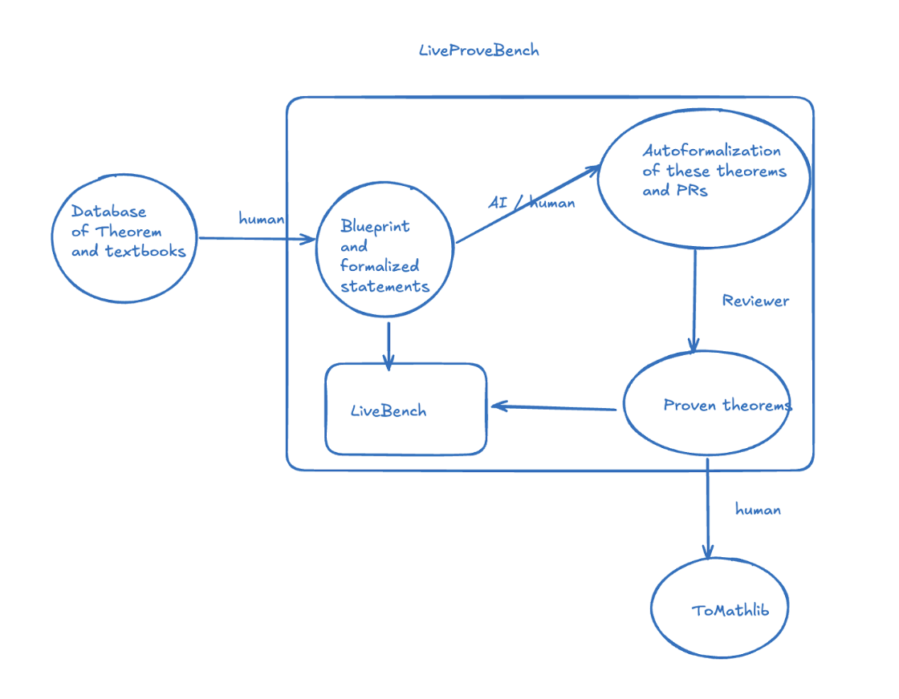

# LiveLeanTriathlon

[](https://opensource.org/licenses/Apache-2.0)

This repository contains a benchmark suite of mathematical theorems
formalized in Lean 4, along with LaTeX blueprints.

It has been adapted from the [Lean Project Template repository](https://github.com/pitmonticone/LeanProject).

## Overview



LiveLeanTriathlon is a benchmark under development
for automated theorem proving and autoformalization in Lean 4.
It consists of a collection of mathematical theorems formalized in Lean 4,
and formalizations of supporting lemmas used in the proofs of these theorems,
along with informal descriptions of these theorems, lemmas, and their proofs
in the form of LaTeX blueprints.
These theorems come from a variety of sources,
including the [1000+ theorems project](https://1000-plus.github.io/),
extensions of projects by individual contributors,
and other mathematical literature. They cover many different mathematical fields.

LiveLeanTriathlon has a few goals:

* To assess the capabilities of automated theorem proving systems
  in Lean 4 on a set of theorems that is more diverse than previous benchmarks
  (which largely focus on competition math) and hopefully more similar to research level mathematics.
* To provide a testbed for autoformalization systems that can take informal descriptions of theorems
  and lemmas and produce formal statements in Lean 4.
* To explore ways of using human-AI collaboration to assist larger scale formalization projects.

Eventually, we hope that LiveLeanTriathlon can help contribute to upstream formalization efforts like
mathlib directly by providing first drafts of formal proofs of important theorems and lemmas
that the community is interested in.

### Repository Layout

The repository is organized as follows (listing the main folders and files):

- `blueprint/src/theorems/`: Contains the LaTeX blueprints for the theorems in the benchmark.
- `blueprint/src/content.tex`: The main LaTeX file that includes the individual theorem blueprints as `\input`s.
- `LiveLeanTriathlon/<TheoremName>/`: Each theorem has its own directory containing:
  - `MainTheorem.lean`: The main theorem statement.
  - `BackgroundLemmas.lean`: Supporting lemmas needed for the main theorem.
  - These files may include `sorry` placeholders for incomplete proofs - we will attempt to fill these in over time using automated tools.
- `LiveLeanTriathlon/Mathlib/`: Contains any lemmas that are needed but not present in mathlib.
- `Mistakes/`: A directory for incorrect formalizations to help learn from mistakes.

## Usage and Contribution

### Install Lean 4

Ensure that you have a functioning Lean 4 installation. If you do not, please follow
the [Lean installation guide](https://leanprover-community.github.io/get_started.html).

### Clone this Repository

To clone this repository to your local machine, please refer to the relevant section of the
GitHub documentation [here](https://docs.github.com/en/repositories/creating-and-managing-repositories/cloning-a-repository).

### Contributing

We welcome contributions to this repository!

As a summary, the main parts of a contribution should include:

- A Lean file `LiveLeanTriathlon/TheoremName/MainTheorem.lean` containing the main theorem statement.
- Potentially other Lean files containing any supporting or mathlib-sendable lemmas needed for the main theorem.
- A LaTeX blueprint proof of the theorem in `blueprint/src/theorems/theorem-name.tex` roughly in sync with the Lean files.

#### PR lifecycle and Label management

Each PR contributing a theorem should have an `awaiting-` label
to indicate what the next step in the PR development is,
and whether it needs contributor, maintainer, or AI attention.
Please use one of the following tags to indicate the status of the PR:

* `non-theorem` = Non-theorem changes (CI, docs, config, tooling, scripts) that don't follow the proof pipeline below and should be reviewed and merged promptly
* `awaiting-human-reference-material` = Waiting for human to provide links to reference material in GitHub PR tracker comments
  * Once this is provided, switch to `awaiting-AI-generate-blueprint`
* `awaiting-AI-generate-blueprint` = Waiting for AI to process reference material / pre-existing blueprint into more elaborate blueprint
  * Once this is done, switch to `awaiting-human-blueprint-review`
* `awaiting-human-blueprint-review` = Waiting for human to review blueprint and correct it
  * Ideally, the blueprint will have lemmas for every step of the formal proof.
  * To make the theorem search go well, it is best to also include here Lean statements of the main theorem and definitions that it or the proof depends on.
  * Once the blueprint is good, switch to `awaiting-AI-generate-formal-statements`
* `awaiting-AI-generate-formal-statements` = Waiting for AI to process blueprint into formalized statements
  * AI should generate formal statements and attempt to prove them, then switch to `awaiting-human-review`
* `awaiting-AI-sorry-attempt` = AI should search for sorries and attempt to prove them
  * AI should search for sorries and attempt to prove them, then switch to `awaiting-human-review`
* `awaiting-human-review` = Waiting for human to review and attempt to prove any remaining sorries (Formerly AI-processed)
  * Human should work on sorries until they are confident all remaining sorries are correct, then switch to `awaiting-maintainer-review`
  * Optionally, make partial progress on sorries and switch back to `awaiting-AI-sorry-attempt`
* `awaiting-maintainer-review` = Proof looks good and maintainer should double-check and merge

Please see the [CONTRIBUTING.md](.github/CONTRIBUTING.md) file for detailed guidelines on how to contribute.

## Licensing

Copyright 2025 Project Numina. All software is licensed under the Apache License,
Version 2.0 (Apache-2.0); you may not use this file except in compliance with
the Apache 2.0 license. You may obtain a copy of the Apache 2.0 license at:
https://www.apache.org/licenses/LICENSE-2.0

The content may be based on third party sources and may in some cases include
third party content. The original source for each theorem is indicated by a
URL within the source file. Third party content may be subject to different
licensing requirements. In particular:

-   Material from Wikipedia articles and MathOverflow is released under the
    Creative Commons Attribution-Share-Alike License 4.0.
-   Material from The Stacks Project is released under the GNU Free
    Documentation License.
-   Material from arXiv is used under the licence applicable to the relevant
    paper, as indicated at the URL within the source file.

Unless required by applicable law or agreed to in writing, all software and
materials distributed here under the Apache 2.0 license are distributed on an
"AS IS" BASIS, WITHOUT WARRANTIES OR CONDITIONS OF ANY KIND, either express or
implied. See the license for the specific language governing permissions and
limitations under the license.

## Blueprint

The theorems in this repository come with LaTeX blueprints that outline the structure of the
proofs. These blueprints are located in the `blueprint/src/theorems` directory.

To view the web or PDF version of the blueprints,
follow the instructions for installing and using the leanblueprint command line tool
from the [blueprint repository](https://github.com/PatrickMassot/leanblueprint).

## Sorry Variants and Benchmark JSONLs

The scripts under [`scripts/create_sorries/`](scripts/create_sorries) derive
benchmark artifacts from the main `LiveLeanTriathlon/` tree by rewriting proofs to
`sorry`. There are two kinds of output: directory variants (full Lake libraries
the agent can build against) and JSONL files (one row per problem, suitable for
batch evaluation).

Both scripts are pure Python (require Python 3.10+) and read from the
canonical `LiveLeanTriathlon/` source. The directory variants
(`LiveLeanTriathlonSorry/`, `LiveLeanTriathlonSorryNoLemmas/`) are gitignored and
regenerated on demand. The three JSONL files under
[`scripts/create_sorries/`](scripts/create_sorries) *are* checked in — CI
re-runs the generator and fails if the working tree drifts, so any source
change that affects them must be regenerated and committed.

### `create_sorries.py` — directory variants

Generates two sibling directories at the project root:

- **`LiveLeanTriathlonSorry/`** — a copy of `LiveLeanTriathlon/` with every
  `theorem`/`lemma` proof replaced by `:= by sorry`. Imports of
  `LiveLeanTriathlon.Mathlib.*` and `LiveLeanTriathlon.Util.*` continue to point at
  the original library; other `LiveLeanTriathlon.*` imports are rewritten to the
  sibling tree. A top-level `LiveLeanTriathlonSorry.lean` index is also produced.
- **`LiveLeanTriathlonSorryNoLemmas/`** — same layout, but only `@[AMS]`-tagged
  main theorems keep `:= by sorry`. Helper lemmas are demoted to `axiom`s, so
  each non-Mathlib folder exposes exactly one open goal.

Both variants are registered as `lean_lib` targets in `lakefile.toml`.

```bash
# Generate both variants (default).
python3 scripts/create_sorries/create_sorries.py

# Generate only one.
python3 scripts/create_sorries/create_sorries.py --variant Sorry
python3 scripts/create_sorries/create_sorries.py --variant SorryNoLemmas

# Build a variant.
lake build LiveLeanTriathlonSorry
lake build LiveLeanTriathlonSorryNoLemmas
```

### `create_statement_jsonl.py` — flat benchmark JSONLs

Writes three JSONL files into `scripts/create_sorries/`. Each row is a single
problem; the agent's task is to prove (or formalize) the goal in the row's
`code` field. Project-specific imports are collapsed to `import Mathlib` and
the `module` directive plus `@[AMS ...]` / `@[blueprint ...]` decorators are
stripped, so each row stands alone.

| File | Granularity | What `code` contains |
|---|---|---|
| `statement.jsonl` | one row per `theorem`/`lemma` | imports + opens + everything from the file's start through the target, with all preceding proofs replaced by `sorry` |
| `statements_hard.jsonl` | one row per `@[AMS]` theorem | imports + opens + earlier same-file `@[AMS]` theorems as `axiom`s + the target with `sorry` |
| `statements_autoformalization.jsonl` | one row per `@[AMS]` theorem | imports + opens + the target with `sorry` only — *plus* `title`, `informal_statement`, and `informal_proof` fields drawn from the matching `blueprint/src/theorems/*.tex` file |

Base schema (all three files):

```json
{"project_name": "...", "name": "...", "type": "theorem"|"lemma", "code": "..."}
```

`statement.jsonl` rows from a file that imports project-local siblings (e.g.
`MainTheorem.lean` importing `BackgroundLemmas.lean`) additionally carry an
`imported_file` field with the transitive sibling content (proofs replaced by
`sorry`, separated by `-- File: <module>` markers). Rows whose file has no
project-local imports omit the field.

`statements_autoformalization.jsonl` adds `title`, `informal_statement`, and
`informal_proof`. The script locates the relevant blueprint chapter by
`\lean{<name>}` lookup against `blueprint/src/theorems/*.tex`. `title` comes
from the `\begin{theorem}[…]` optional argument (falling back to the chapter
heading), `informal_statement` is the body of the matching theorem
environment with `\label`/`\lean`/`\uses` stripped, and `informal_proof` is
the *entire* tex file content — chapter-level context for the whole proof,
not just the prose for one declaration.

```bash
python3 scripts/create_sorries/create_statement_jsonl.py
```

Both scripts are exercised in the `build_sorry_variants` CI job
([.github/workflows/build-project-and-blueprint.yml](.github/workflows/build-project-and-blueprint.yml)),
which generates the variant trees, builds them with Lake, generates the JSONL
files, and validates each row's schema.
